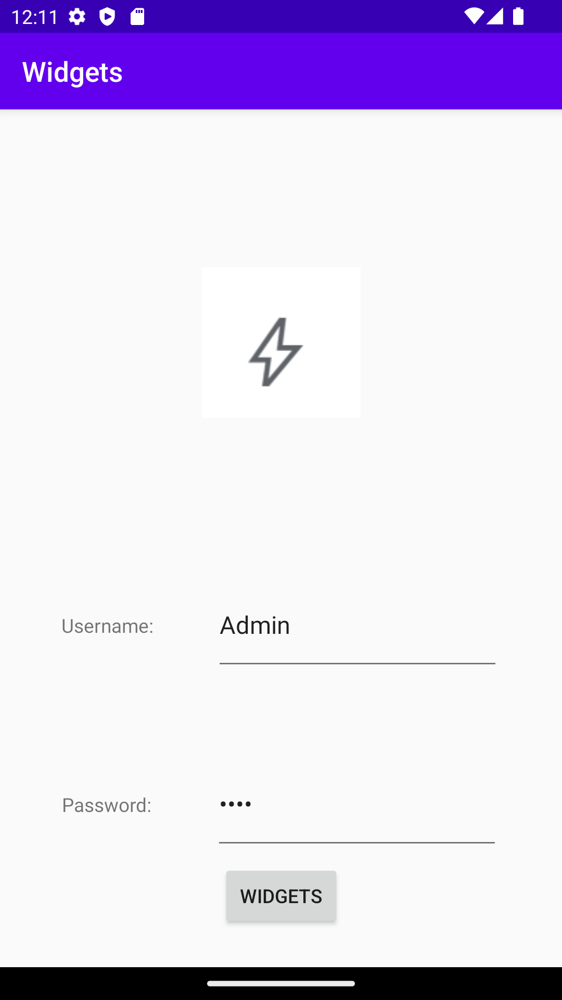

Uppgifts beskrivning
-Your forked GitHub project must have at least three meaningfull commits of code with descriptive comments. Remember to keep your commits brief and your commit messages informative. A reader of the commit history should be able to determine what change is included in a particular commit. We require at least 3 commits of program code that are meaningful.
-Add a layout of your choice, e.g. `LinearLayout` or `ConstraintLayout`
-Add at least three different widgets inside that layout, e.g. `EditText`, `ImageView`, and `Button` and use at least the margin attribute
-Position the widgets in a different way than the way they first appeared when added to the layout

# Assignment 3: Layouts & Views**
**Constrait Layout**
En constrait Layout motsvarar hur innehållet ska representeras med hjälp av 
exempel en layout höjd och bred.

```xml
<androidx.constraintlayout.widget.ConstraintLayout xmlns:android="http://schemas.android.com/apk/res/android"
    xmlns:app="http://schemas.android.com/apk/res-auto"
    xmlns:tools="http://schemas.android.com/tools"
    android:layout_width="match_parent"
    android:layout_height="match_parent"
    tools:context=".MainActivity"/>
```

**TextView**

En textview layout anpassas efter höjden och bredden med ett id som motsvarar textview4
Och inehar en text utifrån sting.xml med namn som motvsarar User. Text view är
positionerad med hjälp av två guidelines och använder sig av en chain för att positionera
sig horisontellt.
```xml
<TextView
        android:id="@+id/textView4"
        android:layout_width="wrap_content"
        android:layout_height="wrap_content"
        android:text="@string/User"
        app:layout_constraintBottom_toTopOf="@+id/guideline2"
        app:layout_constraintEnd_toStartOf="@+id/editTextTextPersonName2"
        app:layout_constraintHorizontal_bias="0.5"
        app:layout_constraintStart_toStartOf="parent"
        app:layout_constraintTop_toTopOf="@+id/guideline" />
```

**EditText**
Jag använde mig av edit text inom en chain med textviews som tydligör innehållet man ska
skriva inom edittext. Edittext är chainad horisontelt och baserad på baselines för att få
innehållet positionerat på rätt plats. 
```xml
<EditText
        android:id="@+id/editTextTextPassword2"
        android:layout_width="wrap_content"
        android:layout_height="0dp"
        android:ems="10"
        android:inputType="textPassword"
        android:text="@string/EditPassword"
        app:layout_constraintBottom_toTopOf="@+id/guideline3"
        app:layout_constraintEnd_toEndOf="parent"
        app:layout_constraintHorizontal_bias="0.5"
        app:layout_constraintStart_toEndOf="@+id/textView5"
        app:layout_constraintTop_toTopOf="@+id/guideline6"
        app:layout_constraintVertical_bias="0.416" />
```
**Button**
Button använder sig av guidelines för att positionera sig på rätt höjd samt utgår från respektive
kant för att centrera det. 

```xml
<Button
        android:id="@+id/button"
        android:layout_width="wrap_content"
        android:layout_height="wrap_content"
        android:text="@string/app_name"
        app:layout_constraintBottom_toTopOf="@+id/guideline4"
        app:layout_constraintEnd_toEndOf="parent"
        app:layout_constraintStart_toStartOf="parent"
        app:layout_constraintTop_toTopOf="@+id/guideline3" />
```
**ImageView**
Centrera Imageview med hjälp av att centrera image från topen samt sidorna på enheten. 
Bottengränsen motsvarar emot en guideline. La även till en SrcCompat som motsvatat bildens ursprung.

```xml
<ImageView
        android:id="@+id/imageView"
        android:layout_width="wrap_content"
        android:layout_height="wrap_content"
        app:layout_constraintBottom_toTopOf="@+id/guideline"
        app:layout_constraintEnd_toEndOf="parent"
        app:layout_constraintStart_toStartOf="parent"
        app:layout_constraintTop_toTopOf="parent"
        app:srcCompat="@drawable/bolt" />
```
